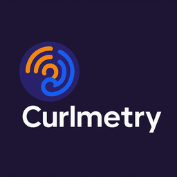

<p style="text-align:center">
  
</p>

# Curlmetry

> 🌀 PSR-18 / PSR-7 OpenTelemetry trace exporter for PHP 5.6 — powered by curl

[](https://www.php.net/releases/5_6_0.php)
[](https://www.php-fig.org/)
[](https://opentelemetry.io/)
[](https://signoz.io/)
[](LICENSE)

---

**Curlmetry** is a lightweight tracing library for legacy PHP applications (5.6+).  
It exports spans to [SigNoz](https://signoz.io/) or [Jaeger](https://www.jaegertracing.io/) via HTTP, and provides a native PSR-18 client using plain `curl`.

No Guzzle. No Symfony. No Composer autoload hell. Just PSR + curl.

---

## ✨ Features

- 📦 PSR-18 client (native curl-based)
- 📡 Exports spans to:
  - OTLP (SigNoz via HTTP JSON)
  - Jaeger (via `/api/traces`)
- 🔧 Span / Tracer / Scope system (OpenTelemetry-style)
- 🧵 Context management (`attach()`, `detach()`, `Scope`)
- 🕵️ Exception + status reporting
- 🐘 Works with **PHP 5.6**

---

## 📦 Installation

```bash
composer require sarigue/curlmetry
```

> Or just clone and `require 'vendor/autoload.php';`

---

## 🚀 Example: OTLP export

```php
use Curlmetry\Tracer;
use Curlmetry\Exporter\OtlpExporter;
use Curlmetry\Processor\SimpleSpanProcessor;

$exporter = new OtlpExporter('http://localhost:4318/v1/traces');
$processor = new SimpleSpanProcessor($exporter, 'curlmetry-demo');
$tracer = new Tracer($processor);

$tracer->startActiveSpan('http.request', function ($span) {
    $span->setAttribute('http.method', 'GET');
    $span->addEvent('processing', ['step' => 'controller']);
    usleep(5000);
});
```

---

## 🌐 PSR-18 usage

```php
use Curlmetry\Psr\CurlHttpClient;
use Curlmetry\Psr\Request;

$client = new CurlHttpClient();

$request = new Request(
    'POST',
    'http://localhost:4318/v1/traces',
    ['Content-Type' => ['application/json']],
    json_encode(['resourceSpans' => [...]])
);

$response = $client->sendRequest($request);
echo $response->getStatusCode();
```

---

## 📚 Docs

- [demo.php](demo.php) — standard usage
- [demo-psr.php](demo-psr.php) — manual PSR request
- [demo-jaeger.php](demo-jaeger.php) — Jaeger JSON exporter

---

## 🛠 Roadmap

- [x] OTLP export (HTTP JSON)
- [x] Jaeger export
- [x] PSR-18 Curl client
- [x] Scope context
- [x] Trace context propagation (W3C)
- [x] Batch processor
- [x] Middleware integration

---

## 📝 License

Apache 2.0 — © 2025 [Sarigue](https://www.githyb.com/sarigue)
